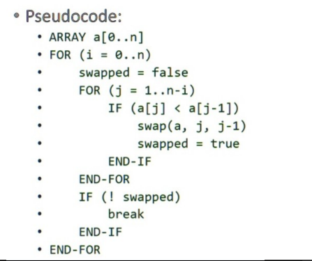
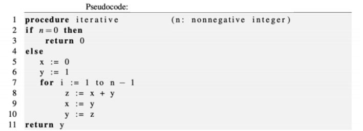

# Taller 1

**Alumno:** Cristina Moreno  
**Materia:** Métodos Numéricos

## Introducción

En este taller se practicarán conceptos de **series numéricas, algoritmos de ordenamiento y convergencia**, además de la **visualización de resultados** con gráficos.

## Ejercicio 1: Sumatoria

Realizar la sumatoria:

$$1 + \frac{1}{2} + \frac{1}{4} + \frac{1}{8} + \frac{1}{16} + \frac{1}{32} +$$...

Tal que el _error absoluto_ cumpla:

$$e < 10^{-1}$$

**Salida en la terminal:**

```python
5
```

## Ejercicio 2: Bubble Sort

Pasar del pseudocódigo el ordenamiento Burbuja (Bubble Sort)


Probar con los vectores (casos de prueba) e imprimir el número de iteración

- v1 = [3,2,5,8,4,1]$

Salida Ordenada en la Terminal:

```python
    [2, 3, 5, 8, 4, 1]
    [2, 3, 5, 4, 8, 1]
    [2, 3, 5, 4, 1, 8]
    [2, 3, 4, 5, 1, 8]
    [2, 3, 4, 1, 5, 8]
    [2, 3, 1, 4, 5, 8]
    [2, 1, 3, 4, 5, 8]
    [1, 2, 3, 4, 5, 8]
```

- v2 = [-1, 0, 4, 5, 6, 7]
  Salida en la Terminal

```python
    [-1, 0, 4, 5, 6, 7]
```

- Con 100000 numero randomicos entre -200 y 145 realizar y ordenar

```python
    Libreria
    import random
    #Generar números random
    r = random.randint(-200,145)
```

## Ejercicio 3: Fibonacci

Realizar el pseudocódigo a código de fibonacci y encontrar su respuesta


Salidas en la terminal cuando:

- n=11
  ```python
        89
  ```
- n=84
  ```python
    160500643816367088
  ```
- n=1531
  ```python
        40793617605237766910177891101532305954169356679469251968012246320785442201399010062608120133898796842159214701491227645296640251351118097414452512943377923944240851901342511998321837317687231200181404989351498771613091128609066442842273029931595972451439617557382711759593384278734694858010024767646023157013418593547269
  ```

## Ejercicio 3.1: Gráfica del Número Áureo

Realizar el número aureo para iteracion hasta n=8 y realizar una gráfica de convergencia
$NumeroÁureo= \frac{fib(n)}{fib(n-1)}$

Librerias

```python
      matplotlib.pyplot
```

## Ejercicio 3.2: Error relativo

Determinar la iteración desde la cual el error relativo de $\frac{y_{i+1}}{y_i} (i>0)$ el ultimo valor divido para el penultimo valor con respeccto a $$\frac{1+\sqrt{5}}{2}$$ esta dentro de $10^-5$

## Ejericio 4: Serie Geometrica

Imprementar la serie geometrica y realizar su gráfica
Verificar a que numero converge o no
$\sum_{i=1}^{n} \frac{1}{i}$

Librerias

```python
      matplotlib.pyplot
```
